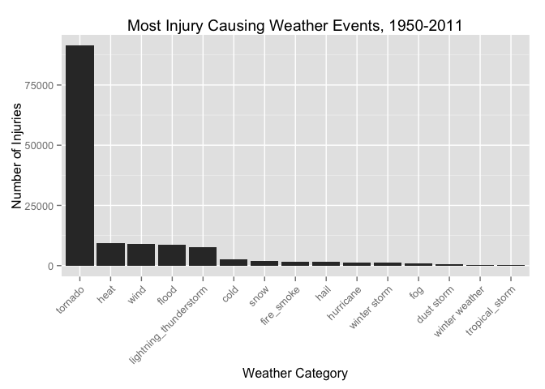
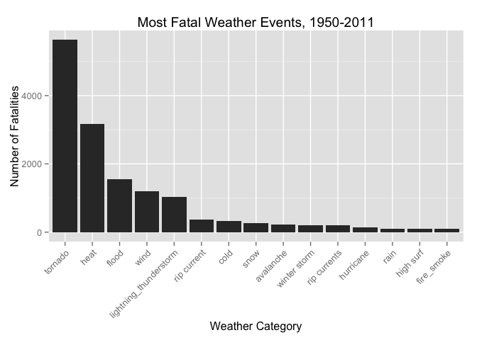
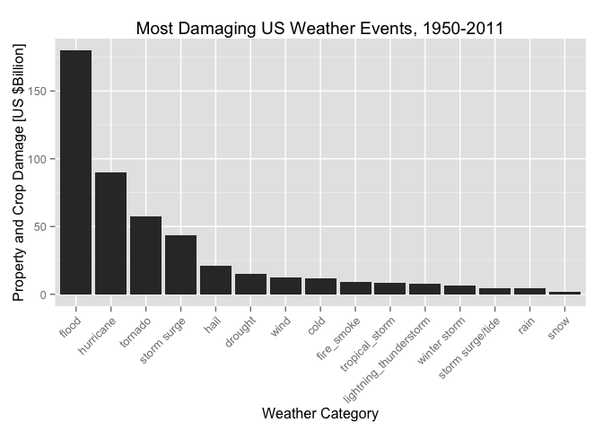

# Report on U.S. Storm Damage (1950 - 2011)
Jason Giacomo  
December 26, 2015  

#Synopsis
The National Oceanic and Atmospheric Administration (NOAA) keeps records on 
sever storm events in the U.S. These data span from 1950 to present. The report
will explore storm impact on human life as well as economic losses.


```r
library(readr)
library(dplyr)
library(lubridate)
library(ggplot2)
```

#Data Processing
The dataset is first downloaded and then unzipped. Then the columns are limited
to those of interest.


```r
# Check if the file has been downloaded and download if not
if(!file.exists("data/repdata-data-StormData.csv.bz2")) {
    download.file("https://d396qusza40orc.cloudfront.net/repdata%2Fdata%2FStormData.csv.bz2", "data/repdata-data-StormData.csv.bz2")
}

# Create the data frame if needed (note: read_csv can import bzipped files)
if(!exists("rawStormData")) {
    StormData <- read_csv("data/repdata-data-StormData.csv.bz2")
}

# Keep only relevent columns
StormData <- StormData %>% select(BGN_DATE, EVTYPE, FATALITIES,
                                  INJURIES, PROPDMG, PROPDMGEXP,
                                  CROPDMG, CROPDMGEXP, REFNUM)

StormData$BGN_DATE <- as.Date(StormData$BGN_DATE, format='%m/%d/%Y')
range(StormData$BGN_DATE)
```

```
## [1] "1950-01-03" "2011-11-30"
```

```r
# Check number of event types
length(unique(StormData$EVTYPE))
```

```
## [1] 977
```

One thing to note is that there are a large number of event types and they have 
not been consistent over the years. Therefore, I have grouped various similar categories into more general categories according to the list below. This assumes the reader of this report is more interested in the type of events rather than the exact event types recorded in the data.


```r
StormData$category <- NA

recateg <- function(df) {
    df[grepl('tornado', tolower(df$EVTYPE)),]$category <- "tornado"
    df[grepl('hurr', tolower(df$EVTYPE)),]$category <- "hurricane"
    df[grepl('cold|chill|ice|cool|frost|icy', tolower(df$EVTYPE)),]$category <- "cold"
    df[grepl('heat|hot|warm', tolower(df$EVTYPE)),]$category <- "heat"
    df[grepl('rain|precip|wet|shower', tolower(df$EVTYPE)),]$category <- "rain"
    df[grepl('wind|wnd', tolower(df$EVTYPE)),]$category <- "wind"
    df[grepl('flood|fld|stream', tolower(df$EVTYPE)),]$category <- "flood"
    df[grepl('snow|blizz', tolower(df$EVTYPE)),]$category <- "snow"
    df[grepl('hail', tolower(df$EVTYPE)),]$category <- "hail"
    df[grepl('fire|smoke', tolower(df$EVTYPE)),]$category <- "fire_smoke"
    df[grepl('tropical', tolower(df$EVTYPE)),]$category <- "tropical_storm"
    df[grepl('fog', tolower(df$EVTYPE)),]$category <- "fog"
    df[grepl('thun|lightn', tolower(df$EVTYPE)),]$category <- "lightning_thunderstorm"
    df[grepl('volc', tolower(df$EVTYPE)),]$category <- "volcanic_activity"
    
    return(df)
}

StormData <- recateg(StormData)

percNotCategorized <- nrow(StormData[is.na(StormData$category),])/
    nrow(StormData)*100

# Replace NA categories with EVTYPE
StormData[is.na(StormData$category),]$category <-
    StormData[is.na(StormData$category),]$EVTYPE
```

After categorizing the event types the uncategorized events amount to
'r percNotCategorized'%. These should not affect the top ranking events.

#Results

##Events Causing the Greatest Harm

The top 15 injury and fatality causing storm events are plotted here.


```r
harm <- StormData %>% group_by(category) %>% summarize(inj=sum(INJURIES), 
                                                       fat=sum(FATALITIES))
harm.sort <- slice(arrange(harm, desc(inj)), 1:15)
harm.sort$category <- tolower(as.character(harm.sort$category))
harm.sort$category <- factor(harm.sort$category, levels=harm.sort$category)

pharm <- ggplot(harm.sort, aes(x=category, y=inj)) +
    geom_bar(stat='identity') + theme(axis.text.x=element_text(angle=45,
                                                               hjust=1)) +
    labs(title="Most Injury Causing Weather Events, 1950-2011",
         x = "Weather Category",
         y = "Number of Injuries")

fatal.sort <- slice(arrange(harm, desc(fat)), 1:15)
fatal.sort$category <- tolower(fatal.sort$category)
fatal.sort$category <- factor(fatal.sort$category,
                                 levels=unique(fatal.sort$category))

pfatal <- ggplot(fatal.sort, aes(x=category, y=fat)) + 
    geom_bar(stat='identity') +
    theme(axis.text.x=element_text(angle=45, hjust=1)) +
    labs(title="Most Fatal Weather Events, 1950-2011", x="Weather Category",
         y="Number of Fatalities")

print(pharm)
```

 

```r
print(pfatal)
```

 

From these plots it is clear that the top five most harmful, in terms of
injuries and fatalities, are tornados, heat, wind, flood, and
lightning/thunderstorms.

##Events Causing the Greatest Economic Damage

Here are the top storm events which cause the most economic damage. In this plot
the damage is represented by the monetary costs in terms of both crop and
property damage. These costs are calculated using the PROPDMG and CROPDMG column values with the appropriate exponentials described in the PROPDMGEXP and CROPDMGEXP columns.


```r
StormData <- mutate(StormData,
     pdexp = ifelse(toupper(PROPDMGEXP)=="B", 9,
                     ifelse(toupper(PROPDMGEXP)=="M", 6,
                            ifelse(toupper(PROPDMGEXP)=="K", 3,
                                   1))),
     cdexp = ifelse(toupper(CROPDMGEXP)=="B", 9,
                     ifelse(toupper(CROPDMGEXP)=="M", 6,
                            ifelse(toupper(CROPDMGEXP)=="K", 3,
                                   1))),
     propcost = PROPDMG*10^pdexp,
     cropcost = CROPDMG*10^cdexp
     )

dmg <- StormData %>% group_by(category) %>%
    summarize(totalCROPdmg = sum(cropcost, na.rm=TRUE),
              totalPROPdmg = sum(propcost, na.rm=TRUE))
dmg <- dmg %>% mutate(totaldmg = totalCROPdmg + totalPROPdmg)
dmg.sort <- slice(arrange(dmg,desc(totaldmg)), 1:15)
dmg.sort$category <- tolower(dmg.sort$category)
dmg.sort$category <- factor(dmg.sort$category,
                                 levels=unique(dmg.sort$category))
```


```r
pdmg <- ggplot(dmg.sort, aes(x=category, y=totaldmg*1e-9)) + 
    geom_bar(stat='identity') +
    theme(axis.text.x=element_text(angle=45, hjust=1)) +
    #scale_y_log10() +
    labs(title="Most Damaging US Weather Events, 1950-2011",
         x="Weather Category",
         y="Property and Crop Damage [US $Billion]")
print(pdmg)
```

 

From the plots above it is clear which weather events lead to the most injuries, fatalities, and economic damage. Planning for severe weather events can be focused on the events which represent the largest risk to human health and economic health.
